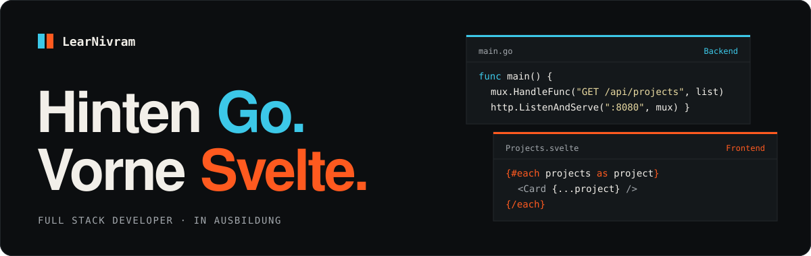

  

  Ich baue Web-Apps von der Datenbank bis zum letzten Pixel, entwickle FiveM-Roleplay-Server 
  und arbeite mit <a href="https://github.com/clyvera"><b>Clyvera</b></a> an Verwaltungssoftware für große Communities.

  
  
  
  
  
  

 

## Projekte

| | Projekt | Worum es geht | Stack |
|---|---|---|---|
| ★ | [**Clyvera**](https://github.com/clyvera) | Verwaltungssoftware für große Communities und Projekte | GitHub-Organisation |
| 01 | **nexus_identity** | Charaktererstellung für FiveM als NUI-Interface | `Svelte 5` `FiveM` `NUI` |
| 02 | **Cake_Manager** | Wer bringt wann Kuchen mit? Rotation unter Kollegen, mit Kalender und Statistiken | `C#` `Angular` `Datenbank` |
| 03 | **Meme Creator** | Terminal-App, die Memes über die Imgflip-API erstellt | `C#` `TUI` |
| 04 | **Neon Bite** | Seminarprojekt mit pygame und einer HTML-Oberfläche über PySide6 WebEngine | `Python` `pygame` `PySide6` |

 

  

